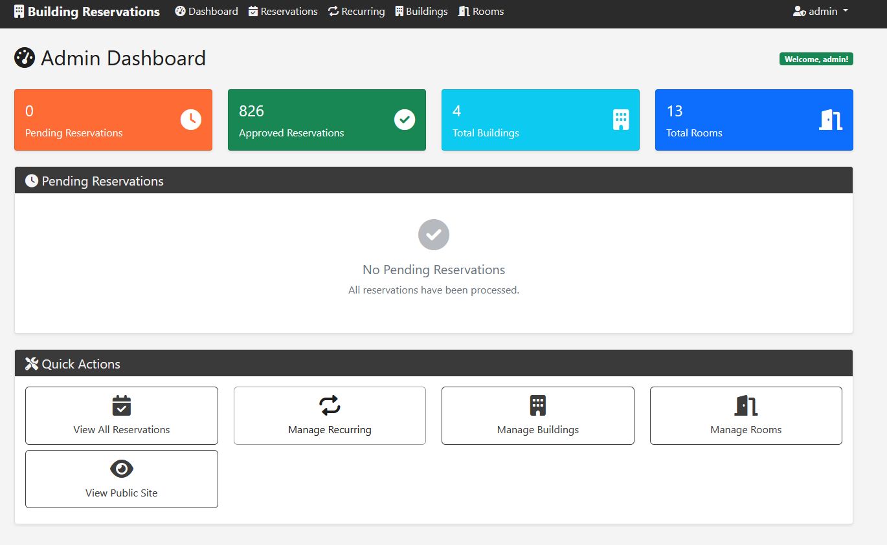
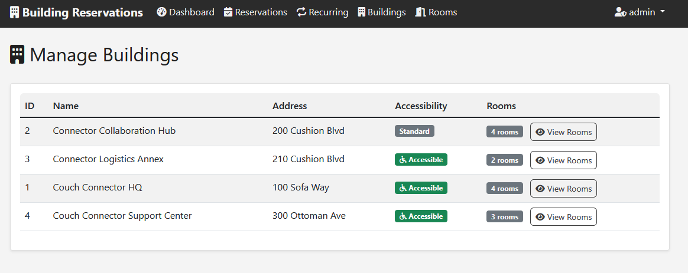
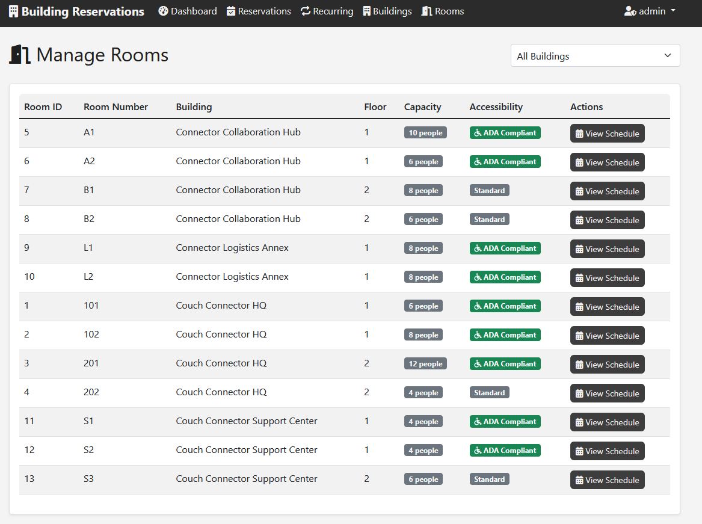
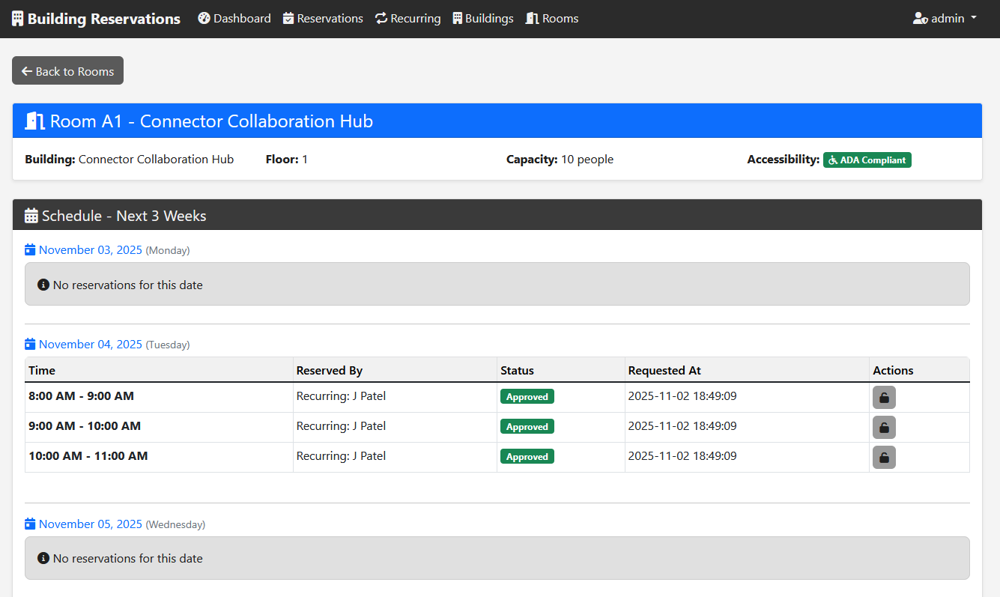
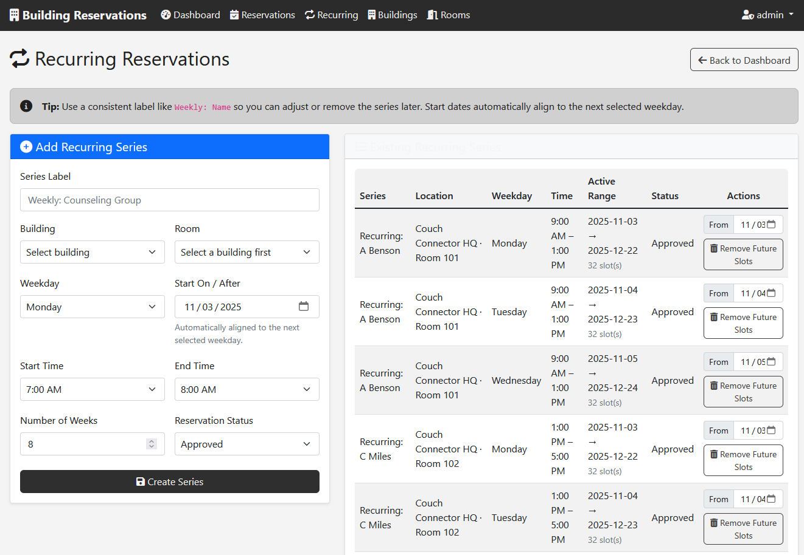
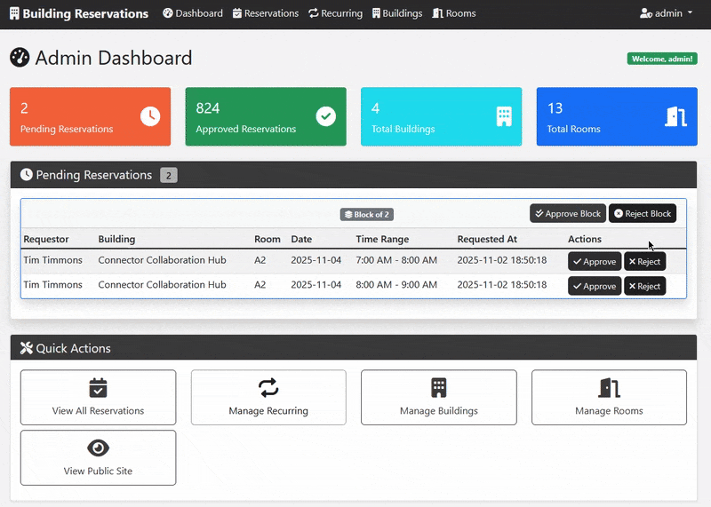

# Building Reservation System

A full-stack web application for managing building and room reservations with both client-facing and administrative interfaces.  
Designed for mid-sized organizations (~100–150 employees). Concurrency is handled through manual approval via the admin console.  
Not intended for large-scale or fully automated deployments.

---

## ⚙️ Tech Stack

| Layer | Technology |
|-------|-------------|
| **Backend** | Flask 3.0.3 (Python 3.12) |
| **Database** | SQLite + seed data |
| **Frontend** | HTML 5 · Bootstrap 5 · custom CSS/JS |
| **Auth** | bcrypt password hashing · session-based login |
| **Deployment** | Azure App Service + Gunicorn + GitHub Actions CI/CD |

---

## 🖼️ Screenshots

| View | Preview |
|------|----------|
| Client landing |  |
| Admin dashboard |  |
| Building details |  |
| Rooms overview |  |
| Room schedule |  |
| Recurring appointments |  |
| Reservation flow |  |
| Approval flow |  |

---

## 🚀 Quick Start

```bash
# Clone and set up
git clone <repository-url>
cd room-and-building-scheduler

# Virtual environment
python -m venv .venv
.venv\Scripts\activate  # Windows
# source .venv/bin/activate  # macOS/Linux

# Install dependencies
pip install -r requirements.txt

# Configure environment
python -c "import secrets; print(secrets.token_hex(32))" > .env
# Edit .env and add:
# SECRET_KEY=<your-generated-key>

# Run locally
python app.py
```

Access:
- **Client:** http://localhost:8000  
- **Admin:** http://localhost:8000/admin/login  
- **Default credentials:** `admin` / `admin123` (⚠️ Change immediately)

---

## 🧩 Core Features

### Client Interface
- 🔍 Smart search by building, floor, date, and time range  
- 📱 Responsive design (Bootstrap 5)  
- 🏢 Dynamic dropdowns for building/floor  
- ⏰ 12-hour time display & weekday/hour validation (7 AM – 5 PM)  
- 📝 Reservation requests routed to admin approval  

### Admin Console
- 🔐 bcrypt authentication with secure sessions  
- 📊 Dashboard with pending approvals  
- ✅ One-click approve/reject workflow  
- 🏗️ Building / Room / Reservation management views  
- 🔁 Recurring series with automatic conflict detection  
- 🎨 Clean sage-green theme  

---

## 🧱 Database Schema

**Schema initialization:** `schema.sql`  
**Seed data:** `seed.sql`

| Table | Key Fields | Notes |
|--------|-------------|-------|
| **Buildings** | `building_id`, `name`, `is_no_stair` | Accessibility flag |
| **Rooms** | `room_id`, `building_id`, `room_num`, `capacity`, `floor`, `is_aca_compliant` | Linked to buildings |
| **Reservations** | `reservation_id`, `room_id`, `slot_date`, `slot_hour`, `status` | Unique (room, date, hour) to prevent double booking |
| **Admins** | `admin_id`, `username`, `password_hash` | bcrypt hash |

💡 To allow multiple *pending* reservations while blocking only *approved* ones:

```sql
CREATE UNIQUE INDEX IF NOT EXISTS uq_approved_room_slot 
ON Reservations(room_id, slot_date, slot_hour) 
WHERE status='approved';
```

---

## 🔐 Security

- bcrypt (cost 12) password hashing  
- Secure, HTTP-only session cookies  
- Environment-based secrets (`SECRET_KEY`)  
- No credentials in source code  
- Admin login rate-limit recommended  
- HTTPS + Entra ID perimeter auth via Azure App Service  

### Production Checklist
- [ ] Change default admin password  
- [ ] Set strong `SECRET_KEY` in Azure App Settings  
- [ ] Enable HTTPS / SSL  
- [ ] Enable App Service Authentication (Entra ID)  
- [ ] Configure automatic backups  
- [ ] Enable Application Insights  
- [ ] Implement simple rate-limiting  

---

## ☁️ Deployment (Azure App Service)

1. **Fork / Clone** the repository  
2. **Create** Azure App Service (Python 3.12 runtime)  
3. **Configure Secrets** (`SECRET_KEY`, `AZURE_WEBAPP_PUBLISH_PROFILE`)  
4. **Startup command:**
   ```bash
   gunicorn -w 2 -t 120 -b 0.0.0.0:8000 app:app
   ```
5. **Push to `main`** — deployment runs automatically via GitHub Actions.  

📖 See [AZURE_DEPLOYMENT.md](AZURE_DEPLOYMENT.md) for full setup.

---

## 🧰 Developer Reference

### Environment Variables

```env
SECRET_KEY=<64-char random string>
FLASK_DEBUG=false
PORT=8000
# DATABASE_PATH=./building_rez.db  (optional override)
```

### Database Commands

```bash
sqlite3 building_rez.db ".tables"
sqlite3 building_rez.db ".schema"
sqlite3 building_rez.db "SELECT * FROM Reservations LIMIT 5;"
```

Reset DB:
```bash
rm building_rez.db && python app.py
```

### Admin Utilities

```bash
python generate_admin_hash.py        # create hash
sqlite3 building_rez.db              # then INSERT/UPDATE as needed
python test_auth.py                  # verify authentication
```

---

## 🧮 Recurring Reservations

- 8-week rolling pattern seeded on first run  
- Admins can create/retire weekly series in UI  
- For production, schedule a **maintenance job** to:  
  1. Delete expired recurring reservations  
  2. Extend future pattern to maintain 8 weeks  
  3. Preserve user-submitted entries  

Implementation options: Azure Function (Timer Trigger), Logic App, or WebJob.  
See detailed example in [AZURE_DEPLOYMENT.md](AZURE_DEPLOYMENT.md).

---

**Built with Flask, SQLite, and Bootstrap**  
**Deployed on Azure App Service**  
**CI/CD via GitHub Actions**
